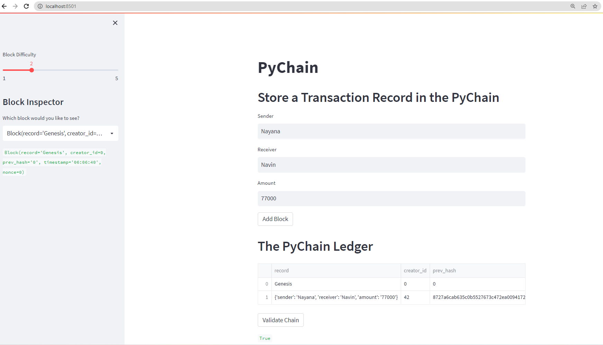
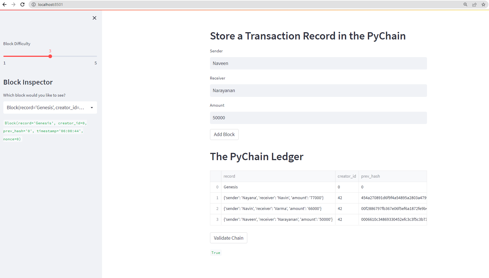

### Blockchain with Python

Constructing a web-based ledger system with a blockchain that is user-friendly. This application uses a blockchain-based ledger to replicate how a bank maintains a log of financial activities, such as money transfers between senders and receivers. Using this ledger, partner banks should be able to carry out transactions and verify the validity of the information in the ledger.

## Technologies
The following package from Python 3.7 is used in this project:

VSCode 

Pandas

Streamlit 

haslib 

## Installation Guide
Before running the application first install the following dependencies.

!pip install streamlit
Next, import required libraries and dependencies.

import streamlit as st
from dataclasses import dataclass
from typing import Any, List
import datetime as datetime
import pandas as pd
import hashlib
 
## Screenshots

## Contributors
Contributed by Nayana Narayanan.

## License
MIT License